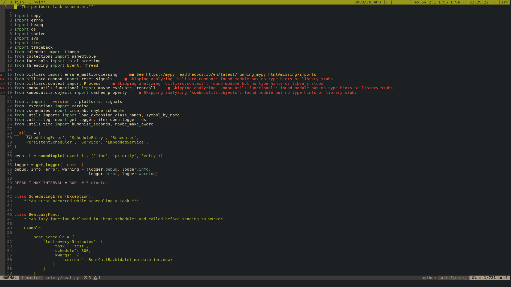

# fzf-lsp.nvim


** For more images check the images folder **

# Installation

Install using [vim-plug](https://github.com/junegunn/vim-plug).
Put this in your `init.vim`.

```vim
Plug 'gfanto/fzf-lsp.nvim'
```

## Requirements

* You need to have `fzf` installed in addition to use this plugin. See <https://github.com/junegunn/fzf/blob/master/README-VIM.md#installation>.
* You need to have `bat` installed for the preview. See <https://github.com/sharkdp/bat>

## Features

This is an extension for fzf that give you the ability to search for symbols
using the neovim builtin lsp.

## Commands and settings

If you have [fzf.vim](https://github.com/junegunn/fzf.vim) installed,
this plugin will respect your `g:fzf_command_prefix` setting.

- Call `:Definitions` to show the definition for the symbols under the cursor
- Call `:Declarations` to show the declaration for the symbols under the cursor\*
- Call `:TypeDefinitions` to show the type definition for the symbols under the cursor\*
- Call `:Implementations` to show the implementation for the symbols under the cursor\*
- Call `:References` to show the references for the symbol under the cursor
- Call `:DocumentSymbols` to show all the symbols in the current buffer
- Call `:WorkspaceSymbols` to show all the symbols in the workspace
- Call `:CodeActions` to show the list of available code actions
- Call `:RangeCodeActions` to show the list of available code actions in the visual selection
- Call `:Diagnostics` to show all the available diagnostic informations in the current buffer

**Note(\*)**: this methods may not be implemented in your language server, especially textDocument/declaration (`Declarations`) it's usually not implemented in favour of textDocument/definition (`Definitions`).

### Handlers

Commands are implemented using sync calls, if you want your calls to be async you can use the standard neovim calls setting his relative handler.
To do that just put the following lines in block in your `init.vim`.

```lua
vim.lsp.handlers["textDocument/codeAction"] = require'fzf_lsp'.code_action_handler
vim.lsp.handlers["textDocument/definition"] = require'fzf_lsp'.definition_handler
vim.lsp.handlers["textDocument/declaration"] = require'fzf_lsp'.declaration_handler
vim.lsp.handlers["textDocument/typeDefinition"] = require'fzf_lsp'.type_definition_handler
vim.lsp.handlers["textDocument/implementation"] = require'fzf_lsp'.implementation_handler
vim.lsp.handlers["textDocument/references"] = require'fzf_lsp'.references_handler
vim.lsp.handlers["textDocument/documentSymbol"] = require'fzf_lsp'.document_symbol_handler
vim.lsp.handlers["workspace/symbol"] = require'fzf_lsp'.workspace_symbol_handler
```
